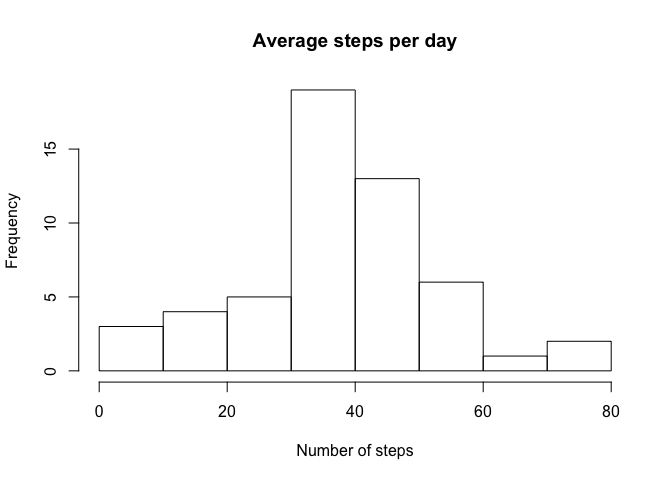
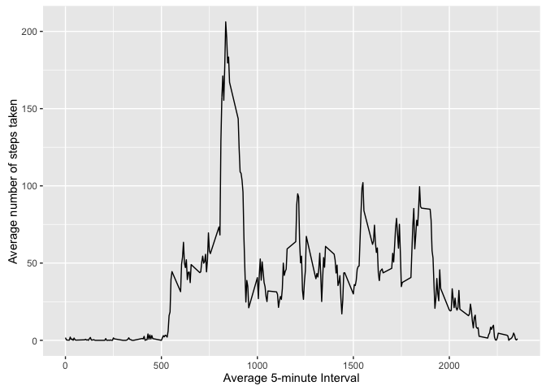

# Reproducible Research: Peer Assessment 1


## Loading and preprocessing the data

```r
# 1. Load the data
activityDataTotal <- read.csv("./activity.csv", sep = ",")
activityData <- na.omit(activityDataTotal)
```

## What is mean total number of steps taken per day?

```r
library(dplyr)
```

```
## 
## Attaching package: 'dplyr'
```

```
## The following objects are masked from 'package:stats':
## 
##     filter, lag
```

```
## The following objects are masked from 'package:base':
## 
##     intersect, setdiff, setequal, union
```

```r
# 1. Calculate the total number of steps taken per day
meanStepsPerDay <- activityData %>%
        group_by(date) %>%
        summarise_each(funs(mean))

# 2. Make a histogram of the total number of steps taken each day
hist(meanStepsPerDay$steps, main = "Average steps per day", xlab ="Number of steps")
```



```r
# 3. Calculate and report the mean and median of the total number of steps 
# taken per day
stepsPerDay <- activityData %>%
        group_by(date) %>%
        summarise_each(funs(sum))

meanStep <- mean(stepsPerDay$steps)
medianStep <- median(stepsPerDay$steps)
```
Mean and median of the total number of steps taken per day are 1.0766189\times 10^{4} and
10765 respectively.

## What is the average daily activity pattern?

```r
# 1. Make a time series plot (i.e. ???????????????? = "????") of the 5-minute interval
# (x-axis) and the average number of steps taken, averaged across all days 
# (y-axis)
meanStepsForInterval <- activityData %>%
        select(steps,interval) %>%
        group_by(interval) %>%
        summarise_each(funs(mean))
library(ggplot2)
```

```
## Warning: package 'ggplot2' was built under R version 3.2.3
```

```r
ggplot(meanStepsForInterval, aes(interval, steps)) + geom_line() +
        xlab("Average 5-minute Interval") + ylab("Average number of steps taken")
```



```r
# 2. Which 5-minute interval, on average across all the days in the dataset, 
# contains the maximum number of steps?
maxStep <- meanStepsForInterval[which.max(meanStepsForInterval$steps),1]
```
The 5-minute interval 835 contains the maximum steps.

## Imputing missing values

```r
# 1. Calculate and report the total number of missing values in the dataset 
# (i.e. the total number of rows with ????????s)
sum(is.na(activityDataTotal$steps))
```

```
## [1] 2304
```

```r
# 2. Devise a strategy for filling in all of the missing values in the dataset. 
# The strategy does not need to be sophisticated. For example, you could use the 
# mean/median for that day, or the mean for that 5-minute interval, etc.
```
Strategy: Filling all the missing values in the dataset with the mean for the 
5-minute interval.


```r
# 3. Create a new dataset that is equal to the original dataset but with the 
# missing data filled in.
data <- activityDataTotal
meanSteps <- meanStepsForInterval
for (i in 1:nrow(data)) {
        if (is.na(data$steps[i])) {
                data$steps[i] <- meanSteps[which(data$interval[i] == meanSteps$interval),]$steps
        }
}

# 4. Make a histogram of the total number of steps taken each day and 
# Calculate and report the mean and median total number of steps taken per 
# day. Do these values differ from the estimates from the first part of the 
# assignment? What is the impact of imputing missing data on the estimates 
# of the total daily number of steps?
ggplot(data, aes(date, steps)) + geom_bar(stat = "identity") +
        xlab("Date") + ylab("Total number of steps") +
        ggtitle("Histogram of total number of steps taken each day")
```


```r
stepsPerDay2 <- data %>%
        group_by(date) %>%
        summarise_each(funs(sum))

meanStep2 <- mean(stepsPerDay2$steps)
medianStep2 <- median(stepsPerDay2$steps)

#difference in the mean/median
meanStep - meanStep2
```

```
## [1] 0
```

```r
medianStep - medianStep2
```

```
## [1] -1.188679
```
The median after imputing missing values is greater than the median before
imputing missing values from the data whereas the means before and after are
same.

## Are there differences in activity patterns between weekdays and weekends?

```r
# 1. Create a new factor variable in the dataset with two levels ??? ???weekday??? and # ???weekend??? indicating whether a given date is a weekday or weekend day.

data$dayOfWeek <- factor(format(as.Date(data$date),"%A"))
levels(data$dayOfWeek) <- list(weekdays = c("Monday", "Tuesday", "Wednesday", "Thursday", "Friday"), weekends = c("Saturday", "Sunday"))
levels(data$dayOfWeek)
```

```
## [1] "weekdays" "weekends"
```

```r
# 2. Make a panel plot containing a time series plot (i.e. ???????????????? = "????") of the #5-minute interval (x-axis) and the average number of steps taken, averaged across all #weekday days or weekend days (y-axis). See the README file in the GitHub repository to #see an example of what this plot should look like using simulated data.
meanbydayOfWeek <- data %>%
        select(-date) %>%
        group_by(interval, dayOfWeek, add = FALSE) %>%
        summarise_each(funs(mean))

library(lattice)
xyplot(meanbydayOfWeek$steps ~ meanbydayOfWeek$interval | meanbydayOfWeek$dayOfWeek, 
       layout = c(1, 2), type = "l", 
       xlab = "5-minute interval", ylab = "Total number of steps")
```


There seem to be more activity during the weekends than the weekdays.
